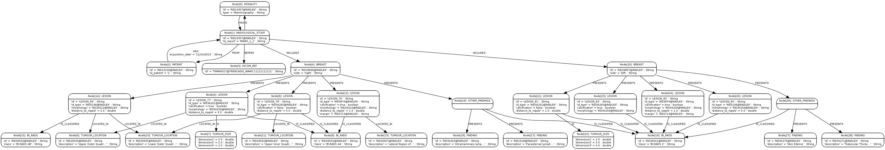

# Gpf4Med -- Graph processing framework for medical information

Gpf4Med is a modular framework for the integration and study of medical 
information, which is distributed under the European Union Public License 
(EUPL v.1.1). Currently, a module is available that allows the study of 
clinical reports on breast cancer. The framework supports DICOM-SR to 
facilitate interoperability among studies collected at different centres 
using clinical examination, medical imaging (mammography, ultrasound, 
magnetic resonance imaging -- MRI) and biopsy.

The data is combined in a graph and the different medical terminologies and 
ontologies annotations are used to interconnect the objects represented in 
the graph (e.g. patient, lesion, exploration). Other types of information 
may be integrated in the future when other information becomes available, 
such as genetic, histopathological, biomolecular and pharmacological data.

A RESTful service is provided that allows users to query the graph. The 
framework can leverage on Cloud computing resources to address the study of 
large datasets. Indeed, the framework aims at supporting studies that cannot 
be addressed solely using the traditional storage and computing systems of 
the hospital.

## Documentation

The most recent version of the documentation is available in the following
directory inside the project:

<WORKSPACE>/gpf4med/gpf4med-project/gpf4med-distro/src/main/doc/

## Release History

View the complete change history at the [Change Log](CHANGELOG.md).

## License

Gpf4Med is released under the [European Union Public Licence (EUPL) v1.1](LICENSE.md).